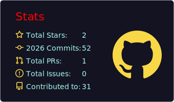
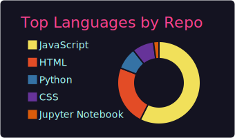

<div align="center">

# Hi, I'm Tito Kilonzo

### A Passionate Full Stack Software Engineer

*Crafting digital experiences with clean code and creative design.*

[](https://git.io/typing-svg)

</div>

---

## About Me

- I'm a **Full Stack Developer** specialized in building exceptional digital experiences.
- Currently working on **Scalable Web Applications & AI Integrations**.
- Currently learning **Advanced System Design and Cloud Architecture**.
- Looking to collaborate on **Open Source Projects and Innovative Startups**.
- Ask me about **HTML, CSS, Python, Next.js, Node.js, and Modern Frameworks**.
- Reach me at: **titokilonzo3@gmail.com**
- Fun fact: **I turn caffeine into code**

---

## My Tech Stack

### Frontend Development

<p align="left">
  
  
  
  
  
  
  
</p>

### Backend & Languages

<p align="left">
  
  
  
  
</p>

### Tools & Databases

<p align="left">
  
  
  
  
  
</p>

---

## GitHub Stats

<div align="center">
  
  
</div>

<div align="center">
  
</div>

---

## Contribution Graph

<div align="center">
  
</div>

---

## Connect with Me

<p align="left">
<a href="mailto:titokilonzo3@gmail.com" target="_blank"></a>
<a href="https://linkedin.com/in/titokinyambu" target="_blank"></a>
<a href="https://twitter.com/SciTechEnthusia" target="_blank"></a>
<a href="https://github.com/TitoKilonzo" target="_blank"></a>
</p>

---

## Featured Projects

### WebApplication-Flask-XT-MongoDB
> A full-stack web application built with Flask and MongoDB.
- **Tech Stack:** Flask, Python, MongoDB, HTML
- [Source Code](https://github.com/TitoKilonzo/WebApplication-Flask-XT-MongoDB-)

### Node.js Weather App
> A dynamic weather application with real-time weather data.
- **Tech Stack:** Node.js, JavaScript, Weather API
- [Source Code](https://github.com/TitoKilonzo/nodejs-weather-app)

### Shift Master
> A cross-platform mobile app for shift management.
- **Tech Stack:** Flutter, Dart
- [Source Code](https://github.com/TitoKilonzo/shift_master)

### ChatBot
> An intelligent chatbot with NLP and AI integration.
- **Tech Stack:** Python
- [Source Code](https://github.com/TitoKilonzo/ChatBot)

---

## Dev Quote

<div align="center">
  
</div>

---

## Current Focus

```javascript
const titoKilonzo = {
    currentFocus: "Building scalable applications with modern tech",
    learning: ["Advanced System Design", "Cloud Architecture", "AI/ML"],
    collaborating: ["Open Source Projects", "Innovative Startups"],
    technologies: {
        frontend: ["React", "Next.js", "TypeScript", "Tailwind CSS"],
        backend: ["Node.js", "Python", "Django", "Express"],
        databases: ["MongoDB", "PostgreSQL"],
        devOps: ["Docker", "Git", "Linux"],
        currentlyExploring: ["AI Integrations", "Microservices", "Cloud Native Apps"]
    },
    funFact: "I turn caffeine into code"
};
```

---

## Get In Touch

- LinkedIn: [Tito Kinyambu](https://linkedin.com/in/titokinyambu)
- Email: titokilonzo3@gmail.com
- Twitter: [@SciTechEnthusia](https://twitter.com/SciTechEnthusia)
- GitHub: [@TitoKilonzo](https://github.com/TitoKilonzo)

---

<div align="center">


**Made with love by Tito Kilonzo**

*"First, solve the problem. Then, write the code." - John Johnson*

</div>
