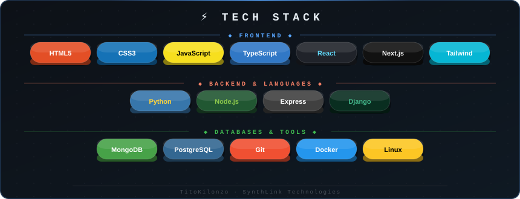

<div align="center">

# Tito Kilonzo

### Full Stack Software Engineer · Cybersecurity Enthusiast · AI Integration Specialist

*Crafting production-grade digital experiences with clean code and thoughtful design.*

[](https://git.io/typing-svg)

[](https://linkedin.com/in/titokinyambu)
[](https://github.com/TitoKilonzo)
[](mailto:titokilonzo3@gmail.com)
[](https://twitter.com/SciTechEnthusia)

</div>

---

## About Me

- 🎓 BSc Information Technology — **Kabarak University, 2025**
- 🔭 Currently building **CyberScribe** — an open-source cybersecurity skills library for AI coding agents
- 🌱 Learning **Advanced System Design, Cloud Architecture & AI/ML**
- 💬 Ask me about **Python, Django, REST APIs, Node.js, React, Cybersecurity**
- 📫 Reach me at: **titokilonzo3@gmail.com**
- ⚡ Fun fact: I turn caffeine into code

---

## 🔴 Live Tech Feed

> *Automated hourly updates — AI & Claude · Cybersecurity · Tech Advances · Dev Insights*

<!-- FEED:START -->
> 🕐 **Live Feed Last Refreshed:** `2026-05-12 at 03:27 UTC` — updates automatically every hour via GitHub Actions.

### 🤖 AI & Claude

<table>
<tr>
<td width="50%" align="center" valign="top">
<a href="https://techcrunch.com/2026/05/10/anthropic-says-evil-portrayals-of-ai-were-responsible-for-claudes-blackmail-attempts/"></a>
</td>
<td width="50%" align="center" valign="top">
<a href="https://techcrunch.com/2026/05/10/were-feeling-cynical-about-xais-big-deal-with-anthropic/"></a>
</td>
</tr>
</table>

### 🔐 Cybersecurity

<table>
<tr>
<td width="50%" align="center" valign="top">
<a href="https://thehackernews.com/2026/05/teampcp-compromises-checkmarx-jenkins.html"></a>
</td>
<td width="50%" align="center" valign="top">
<a href="https://thehackernews.com/2026/05/cpanel-cve-2026-41940-under-active.html"></a>
</td>
</tr>
</table>

### ⚡ Tech Advances

<table>
<tr>
<td width="50%" align="center" valign="top">
<a href="https://www.wired.com/story/cuda-proves-nvidia-is-a-software-company/"></a>
</td>
<td width="50%" align="center" valign="top">
<a href="https://www.wired.com/story/do-city-delivery-drones-make-sense-no-one-knows-but-theyre-flying-over-nyc/"></a>
</td>
</tr>
</table>

### 💻 Dev Insights

<table>
<tr>
<td width="50%" align="center" valign="top">
<a href="https://dev.to/eboo_liu_9efb3e67fdadcaef/i-built-a-local-first-ssh-sftp-workspace-for-developers-469j"></a>
</td>
<td width="50%" align="center" valign="top">
<a href="https://dev.to/vincent_davis_7b6665836a9/membangun-observability-gbim-dari-correlation-id-sampai-dashboard-k6-yang-terisi-3aj1"></a>
</td>
</tr>
</table>


<!-- FEED:END -->

---

## Tech Stack

<p align="center">
  
</p>

---

## 📊 GitHub Stats

<div align="center">

<!-- ── Profile Badges (shields.io — rock solid) ── -->
  
  
  
  
  

  <br/><br/>

  <!-- ── Stats + Languages ── -->

  <br/><br/>

  <!-- ── Contribution Activity Graph (snake replacement) ── -->
  

  <br/><br/>

  <!-- ── Profile Summary Cards (2x2 grid) ── -->
  

  
  
  
  

</div>

---

## Featured Projects

<div align="center">

<a href="https://github.com/TitoKilonzo/CyberScribe"></a>
<a href="https://github.com/TitoKilonzo/Bongotoons"></a>

<a href="https://github.com/TitoKilonzo/NexVault"></a>
<a href="https://github.com/TitoKilonzo/LUMINARY"></a>

<a href="https://github.com/TitoKilonzo/shift_master"></a>
<a href="https://github.com/TitoKilonzo/Gmail-Sentinel"></a>

</div>

---

## Current Focus

```javascript
const titoKilonzo = {
  location:    "Nairobi, Kenya",
  learning:    ["Advanced System Design", "Cloud Architecture", "AI/ML Integration"],
  building:    ["CyberScribe", "Scalable REST APIs", "AI-powered Web Apps"],
  technologies: {
    frontend:  ["React", "Next.js", "TypeScript", "Tailwind CSS", "Vite"],
    backend:   ["Python", "Django", "Node.js", "Express"],
    databases: ["PostgreSQL", "MongoDB", "Appwrite", "Supabase"],
    devOps:    ["Docker", "Git", "Linux", "GitHub Actions"],
    security:  ["Network Security", "Penetration Testing", "SIEM", "Active Directory"],
  },
  funFact:     "I turn caffeine into code ☕",
};
```

---

## Connect

<p align="left">
<a href="mailto:titokilonzo3@gmail.com"></a>
<a href="https://linkedin.com/in/titokinyambu"></a>
<a href="https://twitter.com/SciTechEnthusia"></a>
<a href="https://github.com/TitoKilonzo"></a>
</p>

---

<div align="center">


**Made with 🖤 by Tito Kilonzo**

*"First, solve the problem. Then, write the code." — John Johnson*

</div>
