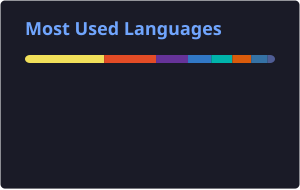
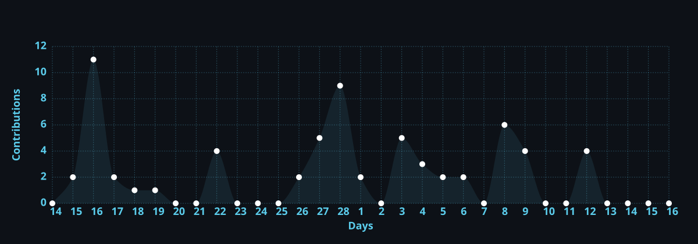

<div align="center">

# Hi, I'm Tito Kilonzo

### A Passionate Full Stack Software Engineer

*Crafting digital experiences with clean code and creative design.*

[](https://git.io/typing-svg)

</div>

---

## About Me

- I'm a **Full Stack Developer** specialized in building exceptional digital experiences.
- Currently working on **Scalable Web Applications & AI Integrations**.
- Currently learning **Advanced System Design and Cloud Architecture**.
- Looking to collaborate on **Open Source Projects and Innovative Startups**.
- Ask me about **HTML, CSS, Python, Next.js, Node.js, and Modern Frameworks**.
- Reach me at: **titokilonzo3@gmail.com**
- Fun fact: **I turn caffeine into code**

---

## My Tech Stack

### Frontend Development

<p align="left">
  
  
  
  
  
  
  
</p>

### Backend & Languages

<p align="left">
  
  
  
  
</p>

### Tools & Databases

<p align="left">
  
  
  
  
  
</p>

---

## GitHub Stats

<div align="center">
  
  
</div>

<div align="center">
  
</div>

---

## Contribution Graph

<div align="center">
  
</div>

---

## 🌐 Live Tech Industry News

> Powered by live RSS feeds · Auto-refreshed every hour by GitHub Actions

<!-- TECH_NEWS:START -->
> 🕐 **Last updated:** `Fri 20 Mar 2026 · 02:31 PM EAT`  ·  Auto-refreshes every hour

| &nbsp; | Headline | Source |
| :---: | :--- | :---: |
| 🔶 | [Cursor Composer 2 is just Kimi K2.5 with RL](https://twitter.com/fynnso/status/2034706304875602030) | **Hacker News** |
| 🔶 | [The Soul of a Pedicab Driver](https://www.sheldonbrown.com/pedicab.html) | **Hacker News** |
| 🔶 | [Essex police pause facial recognition camera use after study finds racial bias](https://www.theguardian.com/technology/2026/mar/19/essex-police-pause-facial-recognition-camera-use-study-racial-bias) | **Hacker News** |
| 🔶 | [FSFE supporters affected: Payment provider Nexi cancelled us](https://fsfe.org/news/2026/news-20260316-01.en.html) | **Hacker News** |
| 🔶 | [ArXiv Declares Independence from Cornell](https://www.science.org/content/article/arxiv-pioneering-preprint-server-declares-independence-cornell) | **Hacker News** |
| 🟢 | [Amazon acquires Rivr, maker of a stair-climbing delivery robot](https://techcrunch.com/2026/03/19/amazon-acquires-rivr-maker-of-a-stair-climbing-delivery-robot/) | **TechCrunch** |
| 🟢 | [Jeff Bezos reportedly wants $100 billion to buy and transform old manufacturing firms w...](https://techcrunch.com/2026/03/19/jeff-bezos-reportedly-wants-100-billion-to-buy-and-transform-old-manufacturing-firms-with-ai/) | **TechCrunch** |
| 🟢 | [Employees had to restrain a dancing humanoid robot after it went wild at a California r...](https://techcrunch.com/2026/03/19/restaurant-dancing-robot-went-wild-hot-pot-cupertino-haidilao-agibot/) | **TechCrunch** |
| 🟢 | [Polymarket continues its partnership spree with a Major League Baseball deal](https://techcrunch.com/2026/03/19/polymarket-continues-its-partnership-spree-with-a-major-league-baseball-deal/) | **TechCrunch** |
| 🟢 | [Online bot traffic will exceed human traffic by 2027, Cloudflare CEO says](https://techcrunch.com/2026/03/19/online-bot-traffic-will-exceed-human-traffic-by-2027-cloudflare-ceo-says/) | **TechCrunch** |
| 🔵 | [Valve’s huge SteamOS 3.8 update adds long-awaited features — and supports Steam Machine](https://www.theverge.com/games/897765/valve-steamos-3-8-update-steam-deck-hibernation-steam-machine-xbox-ally) | **The Verge** |
| 🔵 | [OpenAI is planning a desktop ‘superapp’](https://www.theverge.com/ai-artificial-intelligence/897778/openai-chatgpt-codex-atlas-browser-superapp) | **The Verge** |
| 🔵 | [Sony’s new WF-1000XM6 earbuds are already on sale for $30 off](https://www.theverge.com/gadgets/897668/sony-wf-1000xm6-wireless-earbuds-deal-sale) | **The Verge** |
| 🔵 | [Marc Andreessen is a philosophical zombie](https://www.theverge.com/tldr/897566/marc-andreessen-is-a-philosophical-zombie) | **The Verge** |
| 🔵 | [The coolest game controller for your phone is $50 off](https://www.theverge.com/gadgets/897465/ohsnap-mcon-phone-controller-deal-sale) | **The Verge** |
| 🟣 | [RFK Jr. has destroyed over a quarter of health dept's expert panels](https://arstechnica.com/health/2026/03/rfk-jr-s-war-on-scientific-expertise-destroyed-27-of-agencys-advisor-panels/) | **Ars Technica** |
| 🟣 | [Cloud service providers ask EU regulator to reinstate VMware partner program](https://arstechnica.com/information-technology/2026/03/cloud-service-providers-ask-eu-regulator-to-reinstate-vmware-partner-program/) | **Ars Technica** |
| 🟣 | [Millions of iPhones can be hacked with a new tool found in the wild](https://arstechnica.com/security/2026/03/hundreds-of-millions-of-iphones-can-be-hacked-with-a-new-tool-found-in-the-wild/) | **Ars Technica** |
| 🟣 | [FBI started buying Americans' location data again, Kash Patel confirms](https://arstechnica.com/tech-policy/2026/03/fbi-started-buying-americans-location-data-again-kash-patel-confirms/) | **Ars Technica** |
| 🟣 | [Dogfighting in space won't look like the movies, but this company wants in on it](https://arstechnica.com/space/2026/03/dogfighting-in-space-this-company-builds-satellites-for-high-tempo-engagement/) | **Ars Technica** |
| 🏛️ | [Mind-altering substances are (still) falling short in clinical trials](https://www.technologyreview.com/2026/03/20/1134419/psychedelics-overhyped-psilocybin-depression-placebo/) | **MIT Tech Review** |
| 🏛️ | [The Download: Quantum computing for health, and why the world doesn’t recycle more nucl...](https://www.technologyreview.com/2026/03/19/1134413/the-download-quantum-computing-health-recycling-nuclear-waste/) | **MIT Tech Review** |
| 🏛️ | [Can quantum computers now solve health care problems? We’ll soon find out.](https://www.technologyreview.com/2026/03/19/1134409/a-5-million-prize-awaits-proof-that-quantum-computers-can-solve-health-care-problems/) | **MIT Tech Review** |
| 🏛️ | [Why the world doesn’t recycle more nuclear waste](https://www.technologyreview.com/2026/03/19/1134399/nuclear-waste-reprocessing/) | **MIT Tech Review** |
| 🏛️ | [The Download: The Pentagon’s new AI plans, and next-gen nuclear reactors](https://www.technologyreview.com/2026/03/18/1134371/the-download-the-pentagons-new-ai-plans-and-next-gen-nuclear-reactors/) | **MIT Tech Review** |
<!-- TECH_NEWS:END -->

---

## 📝 Trending Dev Blog Posts

> Fresh posts from top developer bloggers · Updated hourly

<!-- TECH_BLOGS:START -->
> 📡 **Live feed from top dev blogs** · Updated `Fri 20 Mar 2026 · 02:31 PM EAT`


#### 💻 Dev.to

- [Pagination with Shadcn](https://dev.to/isaac-fei/pagination-with-shadcn-3gp4)
- [Secret Value Manager in Go](https://dev.to/isaac-fei/secret-value-manager-in-go-1143)
- [A Simple Next.js File Server](https://dev.to/isaac-fei/a-simple-nextjs-file-server-4dlf)

#### 🏕️ freeCodeCamp

- [How to Set Up WebAuthn in Node.js for Passwordless Biometric Login](https://www.freecodecamp.org/news/set-up-webauthn-in-node-js-for-passwordless-biometric-login/)
- [Software Testing with Playwright](https://www.freecodecamp.org/news/software-testing-with-playwright/)
- [How to Automate Form UX Audits: Errors, Hints, and Keyboard Flows](https://www.freecodecamp.org/news/automate-form-ux-audits-handbook/)

#### 🎨 CSS-Tricks

- [JavaScript for Everyone: Destructuring](https://css-tricks.com/javascript-for-everyone-destructuring/)
- [What’s !important #7: random(), Folded Corners, Anchored Container Queries, and More](https://css-tricks.com/whats-important-7/)
- [4 Reasons That Make Tailwind Great for Building Layouts](https://css-tricks.com/4-reasons-that-make-tailwind-great-for-building-layouts/)

#### 📐 Smashing Magazine

- [Modal vs. Separate Page: UX Decision Tree](https://smashingmagazine.com/2026/03/modal-separate-page-ux-decision-tree/)
- [Anime vs. Marvel/DC: Designing Digital Products With Emotion In Flow](https://smashingmagazine.com/2026/03/anime-marvel-dc-designing-digital-products-emotion-flow/)
- [Moving From Moment.js To The JS Temporal API](https://smashingmagazine.com/2026/03/moving-from-moment-to-temporal-api/)

#### 🚀 LogRocket Blog

- [Exploring Vercel’s JSON Render: build dynamic UI from structured data](https://blog.logrocket.com/vercel-json-render-dynamic-ui/)
- [Stop wasting money on AI: 10 ways to cut token usage](https://blog.logrocket.com/stop-wasting-ai-tokens-10-ways-to-reduce-usage/)
- [Stop fighting forms: The schema-driven approach to validation](https://blog.logrocket.com/stop-fighting-schema-driven-form-validation/)

#### ⚡ DEV: JavaScript

- [A Simple Next.js File Server](https://dev.to/isaac-fei/a-simple-nextjs-file-server-4dlf)
- [A small browser app for geodesics on curved surfaces](https://dev.to/sailwalpranjal/a-small-browser-app-for-geodesics-on-curved-surfaces-c85)
- [🚀 New React Challenge: Play Soroban](https://dev.to/duffmancc/new-react-challenge-play-soroban-3bk9)

#### 🐍 DEV: Python

- [Jupyter AI Extension - Multi-LLM Support](https://dev.to/novatechnolab/jupyter-ai-extension-multi-llm-support-3gp0)
- [How to Make Money with Python Automation in 2025](https://dev.to/caper_dev/how-to-make-money-with-python-automation-in-2025-45jj)
- [UniVerse](https://dev.to/tanish_gawade_839591613fb/universe-cc5)

#### 🤖 DEV: AI / ML

- [5 Data Engineering Techniques That Increased Our LLM Efficiency by 70%](https://dev.to/aiwithmohit/5-data-engineering-techniques-that-increased-our-llm-efficiency-by-70-1coj)
- [Complete Guide: How To Make Money With Ai](https://dev.to/m_sshadow_9faef2413b29/complete-guide-how-to-make-money-with-ai-4fd3)
- [Building an AI Internship & Career Advisor with Memory: Personalized Guidance that Evol...](https://dev.to/amruta_sk_7c5de897bcad84/building-an-ai-internship-career-advisor-with-memory-personalized-guidance-that-evolves-2k2l)
<!-- TECH_BLOGS:END -->

---

## 🚀 Featured Projects

> Live from GitHub — auto-updated every hour with latest repos & stats

<!-- FEATURED_PROJECTS:START -->
> 🤖 **Auto-fetched from GitHub API** · Updated `Fri 20 Mar 2026 · 02:31 PM EAT`

### 🟨 [Bongotoons](https://github.com/TitoKilonzo/Bongotoons)
> No description provided.
- **Language:** JavaScript  **Stars:** ⭐ 0  **Forks:** 🍴 0
- [📂 Source Code](https://github.com/TitoKilonzo/Bongotoons)

### 🎯 [shift_master](https://github.com/TitoKilonzo/shift_master)
> No description provided.
- **Language:** Dart  **Stars:** ⭐ 0  **Forks:** 🍴 0
- [📂 Source Code](https://github.com/TitoKilonzo/shift_master)

### 🐍 [ChatBot](https://github.com/TitoKilonzo/ChatBot)
> No description provided.
- **Language:** Python  **Stars:** ⭐ 0  **Forks:** 🍴 0
- [📂 Source Code](https://github.com/TitoKilonzo/ChatBot)

### 🟨 [nodejs-weather-app](https://github.com/TitoKilonzo/nodejs-weather-app)
> No description provided.
- **Language:** JavaScript  **Stars:** ⭐ 1  **Forks:** 🍴 0
- [📂 Source Code](https://github.com/TitoKilonzo/nodejs-weather-app)

### 🌐 [WebApplication-Flask-XT-MongoDB-](https://github.com/TitoKilonzo/WebApplication-Flask-XT-MongoDB-)
> No description provided.
- **Language:** HTML  **Stars:** ⭐ 1  **Forks:** 🍴 0
- [📂 Source Code](https://github.com/TitoKilonzo/WebApplication-Flask-XT-MongoDB-)

### 🐍 [TitoKilonzo](https://github.com/TitoKilonzo/TitoKilonzo)
> No description provided.
- **Language:** Python  **Stars:** ⭐ 0  **Forks:** 🍴 0
- [📂 Source Code](https://github.com/TitoKilonzo/TitoKilonzo)

<!-- FEATURED_PROJECTS:END -->

---

## Dev Quote

<div align="center">
  
</div>

---

## Current Focus

```javascript
const titoKilonzo = {
    currentFocus: "Building scalable applications with modern tech",
    learning: ["Advanced System Design", "Cloud Architecture", "AI/ML"],
    collaborating: ["Open Source Projects", "Innovative Startups"],
    technologies: {
        frontend: ["React", "Next.js", "TypeScript", "Tailwind CSS"],
        backend: ["Node.js", "Python", "Django", "Express"],
        databases: ["MongoDB", "PostgreSQL"],
        devOps: ["Docker", "Git", "Linux"],
        currentlyExploring: ["AI Integrations", "Microservices", "Cloud Native Apps"]
    },
    funFact: "I turn caffeine into code"
};
```

---

## Connect with Me

<p align="left">
<a href="mailto:titokilonzo3@gmail.com" target="_blank"></a>
<a href="https://linkedin.com/in/titokinyambu" target="_blank"></a>
<a href="https://twitter.com/SciTechEnthusia" target="_blank"></a>
<a href="https://github.com/TitoKilonzo" target="_blank"></a>
</p>

---

<div align="center">


**Made with love by Tito Kilonzo**

*"First, solve the problem. Then, write the code." - John Johnson*

</div>
