<div align="center">

# Tito Kilonzo

### Full Stack Software Engineer · Cybersecurity Enthusiast · AI Integration Specialist

*Crafting production-grade digital experiences with clean code and thoughtful design.*

[](https://git.io/typing-svg)

[](https://linkedin.com/in/titokinyambu)
[](https://github.com/TitoKilonzo)
[](mailto:titokilonzo3@gmail.com)
[](https://twitter.com/SciTechEnthusia)

</div>

---

## About Me

- 🎓 BSc Information Technology — **Kabarak University, 2025**
- 🔭 Currently building **CyberScribe** — an open-source cybersecurity skills library for AI coding agents
- 🌱 Learning **Advanced System Design, Cloud Architecture & AI/ML**
- 💬 Ask me about **Python, Django, REST APIs, Node.js, React, Cybersecurity**
- 📫 Reach me at: **titokilonzo3@gmail.com**
- ⚡ Fun fact: I turn caffeine into code

---

## 🔴 Live Tech Feed

> *Automated hourly updates — AI & Claude · Cybersecurity · Tech Advances · Dev Insights*

<!-- FEED:START -->
> 🕐 **Live Feed Last Refreshed:** `2026-04-17 at 02:28 UTC` — updates automatically every hour via GitHub Actions.

### 🤖 AI & Claude

<table>
<tr>
<td width="50%" align="center" valign="top">
<a href="https://techcrunch.com/2026/04/16/openai-takes-aim-at-anthropic-with-beefed-up-codex-that-gives-it-more-power-over-your-desktop/">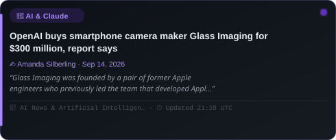</a>
</td>
<td width="50%" align="center" valign="top">
<a href="https://techcrunch.com/2026/04/16/anthropic-cpo-leaves-figmas-board-after-reports-he-will-offer-a-competing-product/">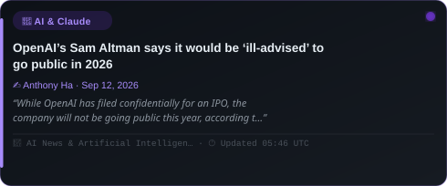</a>
</td>
</tr>
</table>

### 🔐 Cybersecurity

<table>
<tr>
<td width="50%" align="center" valign="top">
<a href="https://thehackernews.com/2026/04/newly-discovered-powmix-botnet-hits.html">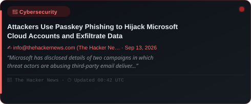</a>
</td>
<td width="50%" align="center" valign="top">
<a href="https://thehackernews.com/2026/04/threatsday-bulletin-17-year-old-excel.html"></a>
</td>
</tr>
</table>

### ⚡ Tech Advances

<table>
<tr>
<td width="50%" align="center" valign="top">
<a href="https://www.wired.com/story/the-uk-launches-its-dollar675-million-sovereign-ai-fund/">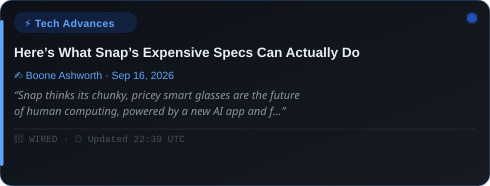</a>
</td>
<td width="50%" align="center" valign="top">
<a href="https://www.wired.com/story/anthropic-plots-major-london-expansion/">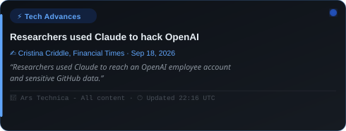</a>
</td>
</tr>
</table>

### 💻 Dev Insights

<table>
<tr>
<td width="50%" align="center" valign="top">
<a href="https://dev.to/yang_goufang_23c7ba674984/ai-weekly-20260410-0417-the-model-lockdown-is-here-but-the-toolchain-is-the-real-lh">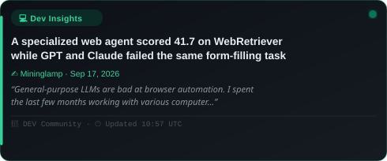</a>
</td>
<td width="50%" align="center" valign="top">
<a href="https://dev.to/yang_goufang_23c7ba674984/ai-zhou-bao-20260410-20260417mo-xing-feng-suo-chao-lai-liao-dan-gong-ju-lian-cai-shi-zhen-zhan-chang-379o">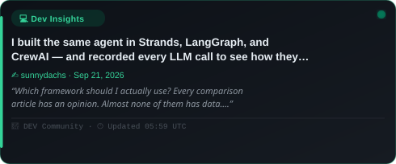</a>
</td>
</tr>
</table>


<!-- FEED:END -->

---

## Tech Stack

### Frontend

<p align="left">
  
  
  
  
  
  
  
</p>

### Backend & Languages

<p align="left">
  
  
  
  
</p>

### Databases & Tools

<p align="left">
  
  
  
  
  
</p>

---

## GitHub Stats

<div align="center">
  
</div>

<div align="center">
  <picture>
    <source media="(prefers-color-scheme: dark)" srcset="assets/github-stats/github-contribution-grid-snake-dark.svg">
    <source media="(prefers-color-scheme: light)" srcset="assets/github-stats/github-contribution-grid-snake.svg">
    
  </picture>
</div>

---

## Featured Projects

<div align="center">

<a href="https://github.com/TitoKilonzo/CyberScribe">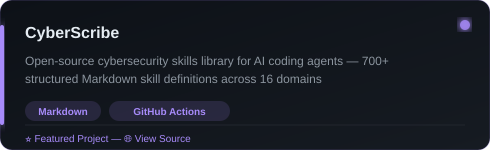</a>
<a href="https://github.com/TitoKilonzo/Bongotoons">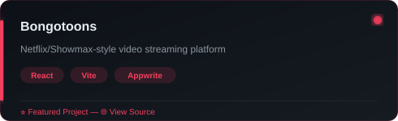</a>

<a href="https://github.com/TitoKilonzo/NexVault">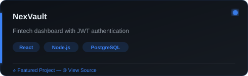</a>
<a href="https://github.com/TitoKilonzo/LUMINARY">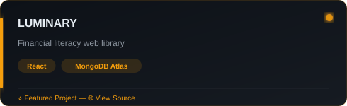</a>

<a href="https://github.com/TitoKilonzo/shift_master">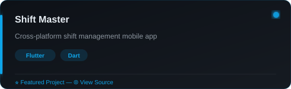</a>
<a href="https://github.com/TitoKilonzo/Gmail-Sentinel">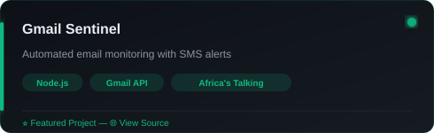</a>

</div>

---

## Current Focus

```javascript
const titoKilonzo = {
  location:    "Nairobi, Kenya",
  learning:    ["Advanced System Design", "Cloud Architecture", "AI/ML Integration"],
  building:    ["CyberScribe", "Scalable REST APIs", "AI-powered Web Apps"],
  technologies: {
    frontend:  ["React", "Next.js", "TypeScript", "Tailwind CSS", "Vite"],
    backend:   ["Python", "Django", "Node.js", "Express"],
    databases: ["PostgreSQL", "MongoDB", "Appwrite", "Supabase"],
    devOps:    ["Docker", "Git", "Linux", "GitHub Actions"],
    security:  ["Network Security", "Penetration Testing", "SIEM", "Active Directory"],
  },
  funFact:     "I turn caffeine into code ☕",
};
```

---

## Connect

<p align="left">
<a href="mailto:titokilonzo3@gmail.com"></a>
<a href="https://linkedin.com/in/titokinyambu"></a>
<a href="https://twitter.com/SciTechEnthusia"></a>
<a href="https://github.com/TitoKilonzo"></a>
</p>

---

<div align="center">


**Made with 🖤 by Tito Kilonzo**

*"First, solve the problem. Then, write the code." — John Johnson*

</div>
